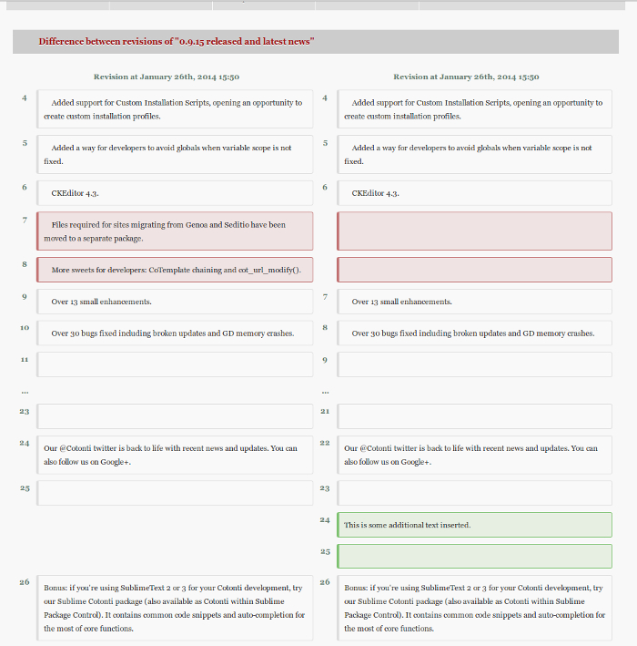

# Work in progress

## Credits

 - [php-diff](https://github.com/chrisboulton/php-diff): A comprehensive library for generating differences between two strings in multiple formats (unified, side by side HTML etc). Based on the difflib implementation in Python